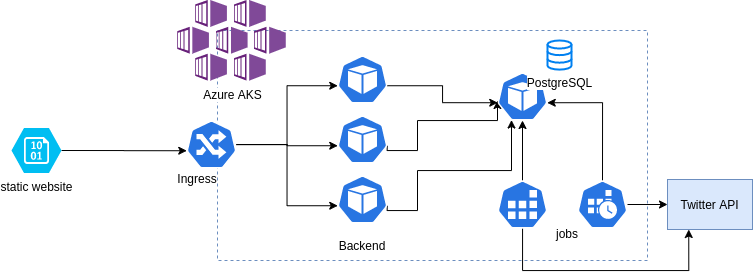

# Twittexpol
It is simple application deployed on Azure using Pulumi. You can see the popularity of words tweeted by politicians in Poland.

https://storageaccount50500af3.z16.web.core.windows.net/?fbclid=IwAR3WHbE8ruTDzxxYFYXE21WNcWqdvlwdz3IOAvZ1cBvHZfWH7rgsgPkN_5g

## Architecture

### Backend

* Deployed on Kubernetes
* Python - FastAPI and SQLAlchemy
* PostgreSQL Database
* Job and cronjob update the database with new tweets
* Nginx-ingress provides HTTPS termination

### Front 

* Vue.js
* Blob storage static website

### Deployment

* Pulumi azure-native
* Github Actions